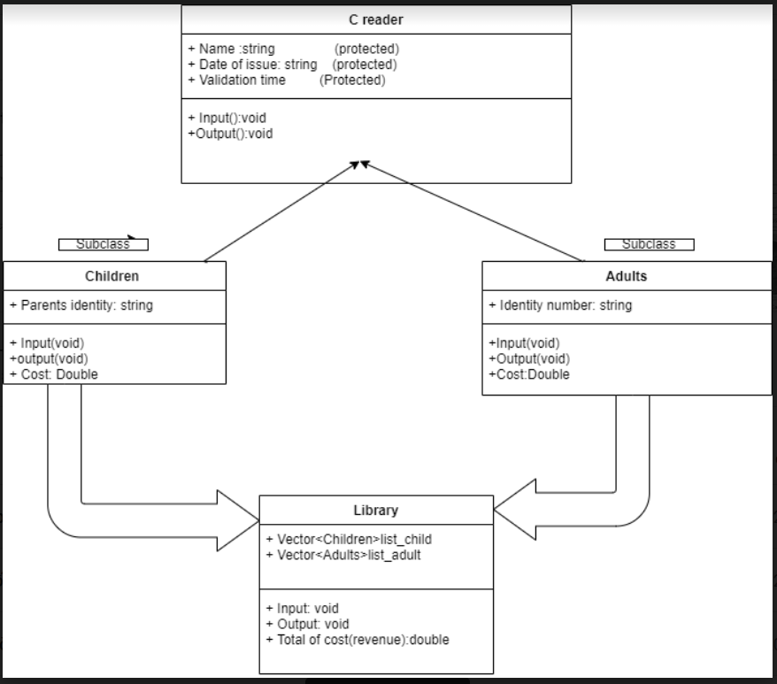

# Library-Control
## Introduction
From my mother ‘s job: I want to create a program which could fulfill the below requirements:

1.Managing the registration of readers( children and adults) in library
General features: The data of readers include:
- Name
- Date of issue
- Validation time (months)
- Cost of registration( 5 dollar per month for children, and 10 dollar per month for adults)

2.Specific features:

+ Children need to have the name of their parents (one person)

+ Adults need to present identity number
## Project Description
* Relation between based and derived class

* Based on this diagram, constructing Reader class(Base) and Children,Reader(derived)
* Using polymorphism feature of OOP to write function calculating the total registration fees for readers.